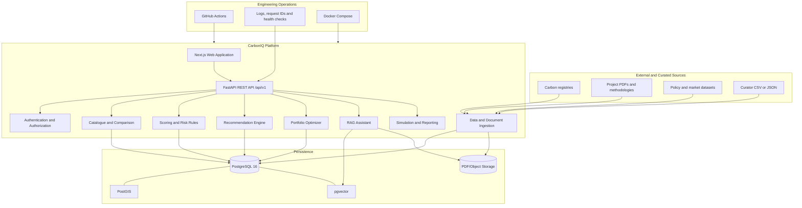
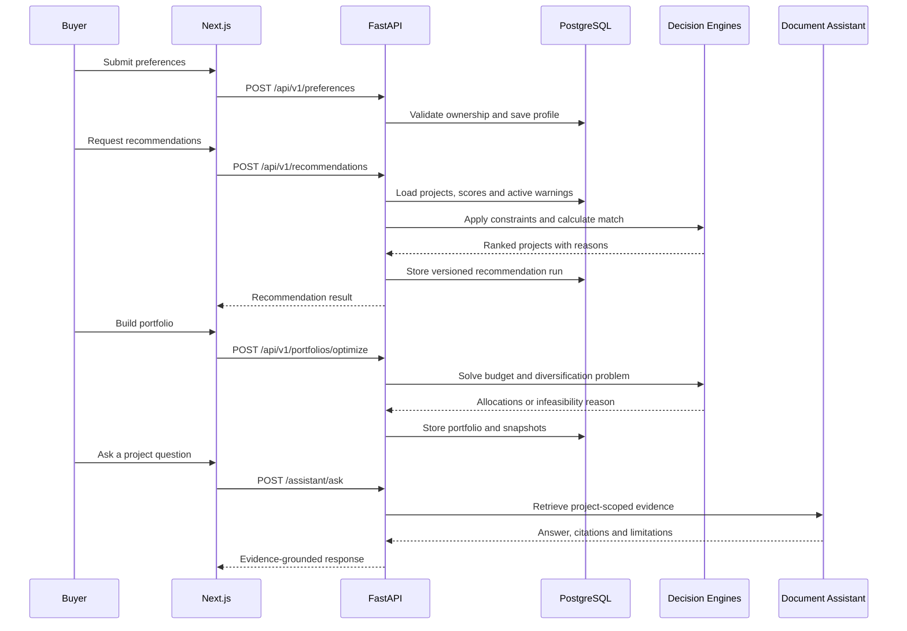
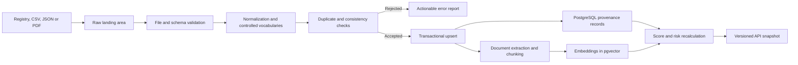

# CarbonIQ — Complete Project Documentation

**Document type:** Product, technical, data, AI and delivery specification
**Target:** Academic MVP with a startup-ready foundation
**Last reviewed:** 9 September 2026
**API version:** `v1`
**Scoring methodology:** `1.0.0`

---

## 1. Executive summary

CarbonIQ is an AI-assisted carbon-credit intelligence and comparison platform. It helps organizations discover carbon projects, compare their price and quality, understand evidence and risk, receive personalized recommendations, construct a diversified portfolio, ask questions about project documents and simulate a purchase.

The product can be described as an **Amazon-style discovery and decision platform for carbon credits**, but the MVP is not a real exchange. It does not collect payments, transfer ownership, retire credits on a registry or provide legal, investment or climate-claim advice.

CarbonIQ solves a practical problem: carbon-market information is fragmented across registries, project documents, standards, marketplaces and policy sources. Two credits representing one tonne of carbon-dioxide equivalent may differ significantly in additionality, permanence, verification quality, co-benefits, price, delivery risk and suitability for a buyer's goal. CarbonIQ brings these factors into one evidence-aware workflow.

## 2. Product vision

The long-term vision is to become a trusted decision layer between carbon-credit buyers, project developers, registries and market infrastructure.

The MVP answers five buyer questions:

1. Which projects satisfy my budget and requirements?
2. Which projects have stronger evidence and climate integrity?
3. What risks or missing information should I review?
4. Why did CarbonIQ recommend one project over another?
5. How can I diversify a carbon-credit portfolio instead of relying on one project?

## 3. Carbon-credit foundations

One carbon credit represents one metric tonne of carbon-dioxide equivalent (`tCO2e`) reduced, avoided or removed from the atmosphere under the rules of a crediting program.

Carbon projects generally fall into these categories:

| Category | Meaning | Examples |
|---|---|---|
| Avoidance | Prevents emissions that would otherwise occur | Forest conservation, avoided deforestation |
| Reduction | Reduces emissions from an existing activity | Improved cookstoves, methane capture, renewable-energy displacement |
| Removal | Captures and stores carbon already in the atmosphere | Reforestation, soil carbon, biochar, direct-air capture |
| Mixed | Contains more than one mitigation pathway | Integrated landscape programs |

Credits are issued by a registry or crediting program only after the applicable project process has been completed. Registry, methodology, validation, verification, monitoring, issuance, vintage and retirement information are therefore separate facts and must not be collapsed into a single “verified” badge.

## 4. Target users

### 4.1 Primary users

- Small and medium-sized organizations exploring voluntary carbon credits
- Corporate sustainability and ESG teams
- Universities and public institutions
- Consultants comparing projects for clients

### 4.2 Secondary users

- Carbon-project developers seeking consistent project presentation
- Researchers and students studying carbon-market quality and pricing

### 4.3 Platform roles

| Role | Responsibilities |
|---|---|
| Visitor | Browse educational content and a limited public catalogue |
| Buyer | Save preferences, obtain recommendations, build portfolios, ask questions and simulate orders |
| Curator | Import project data and documents and initiate recalculation |
| Administrator | Manage authorized platform operations and audits |

## 5. Product boundaries

### 5.1 Included in the MVP

- Catalogue containing at least 30 curated carbon projects
- Search, filtering, sorting and pagination
- Project details and source provenance
- Comparison of two to four projects
- Transparent quality, impact, value, compatibility and risk indicators
- Evidence-confidence calculation
- Buyer preference profiles
- Personalized, explainable recommendations
- Budget-constrained portfolio optimization
- Deterministic risk-warning signals
- Project-document ingestion and retrieval-augmented question answering
- Simulated orders and downloadable demonstration reports
- Authentication, authorization, testing, CI and Docker-based local development

### 5.2 Explicitly excluded from the MVP

- Real payment or settlement
- Transfer of legal ownership
- Registry retirement
- KYC, KYB, AML or sanctions processing
- Live exchange connectivity or guaranteed live prices
- Production blockchain or tokenization
- Guaranteed fraud detection
- Guaranteed compliance or claims eligibility
- Investment, tax, legal or climate-claim advice
- Full satellite-based measurement, reporting and verification

## 6. Core product capabilities

### 6.1 Project discovery

Users search and filter projects by name, developer, project type, category, country, registry, verification status, vintage, price, risk and Sustainable Development Goal. Unknown values are displayed as **Not available**, never converted to zero.

### 6.2 Project comparison

Users compare two to four projects side by side. CarbonIQ aligns common attributes, score components, evidence confidence, risk warnings, inventory and provenance without declaring a universal winner.

### 6.3 Decision intelligence

CarbonIQ calculates transparent, versioned scores. Every score identifies the inputs, deductions, missing evidence and calculation version responsible for the result.

### 6.4 Personalized recommendations

Buyer constraints are applied first. Eligible projects are then ranked by fit, quality, risk, value, geography, category and SDG preferences. Results include positive reasons and trade-offs.

### 6.5 Portfolio optimization

The optimizer distributes the required number of credits across eligible projects while respecting budget, availability, minimum and maximum project count and concentration limits.

### 6.6 Document intelligence

Project PDFs are extracted, split into passages, embedded and indexed. A buyer can ask a question about one project and receive an answer grounded in retrieved passages with document and page references.

### 6.7 Simulated procurement

A saved portfolio can become a simulated order. The report records immutable price, score, warning and source snapshots and prominently states that no credits were purchased, transferred or retired.

## 7. End-to-end user flow

```mermaid
flowchart LR
    A[Register or sign in] --> B[Browse catalogue]
    B --> C[Filter and compare projects]
    C --> D[Inspect evidence, scores and warnings]
    D --> E[Save budget, goals and risk tolerance]
    E --> F[Receive ranked recommendations]
    F --> G[Generate diversified portfolio]
    G --> H[Ask document-grounded questions]
    H --> I[Review final portfolio]
    I --> J[Confirm simulated order]
    J --> K[Download transparent report]
```



Alternative flows are part of the design:

- Insufficient evidence produces an unscored state.
- Incompatible portfolio constraints produce a clear infeasibility explanation.
- AI unavailability does not disable catalogue, scoring or portfolio functions.
- Expired sessions return users to the previous safe location after authentication.
- Stale recommendations prompt recalculation against the current data snapshot.

## 8. Final MVP architecture

CarbonIQ uses a **modular-monolith architecture**. The frontend, API and database run as separate deployable components, while business capabilities remain modules inside one FastAPI codebase. This keeps the academic MVP manageable and preserves clean boundaries for later extraction.



### 8.1 Architectural rules

1. The browser never connects directly to PostgreSQL or object storage.
2. FastAPI is the only public business-data interface.
3. Authorization is enforced server-side for every private resource.
4. Verified facts, derived scores, synthetic fields and AI text remain distinguishable.
5. Expensive calculations store input snapshots and algorithm versions.
6. RAG retrieval is restricted to documents belonging to the selected project.
7. External AI failure cannot break deterministic platform functions.
8. Database migrations are append-only after they reach the shared `main` branch.

## 9. Request and service flow



## 10. Repository structure

```text
Carbon-IQ/
├── apps/
│   └── web/                       # Next.js frontend
├── services/
│   └── api/
│       ├── alembic/               # Database migrations
│       ├── app/
│       │   ├── api/routes/        # REST endpoints
│       │   ├── core/              # Settings, security and logging
│       │   ├── data_pipeline/     # Import and validation
│       │   ├── database/          # Engine, sessions and metadata
│       │   ├── models/            # SQLAlchemy persistence models
│       │   ├── portfolio/         # Optimization
│       │   ├── rag/               # Ingestion, retrieval and assistant
│       │   ├── recommendation/    # Filtering and ranking
│       │   ├── risk/              # Warning rules and anomaly research
│       │   ├── schemas/           # Pydantic API contracts
│       │   ├── scoring/           # Versioned scoring functions
│       │   └── services/          # Application orchestration
│       └── tests/                  # Backend tests
├── data/
│   ├── raw/                        # Unmodified local source files
│   ├── processed/                  # Validated normalized output
│   ├── documents/                  # Local project documents
│   └── sample/                     # Safe demonstration fixtures
├── docs/                            # Product and engineering contracts
├── infrastructure/                  # Deployment configuration
├── scripts/                         # Import and developer utilities
├── tests/e2e/                       # Cross-stack browser tests
├── docker-compose.yml
└── README.md
```

## 11. Data-source strategy

CarbonIQ does not treat every source as equally authoritative. Project identity, status, issuance and retirement facts should come from the relevant registry. Methodology and eligibility claims should come from the responsible standard or public authority. Market-price snapshots require a licensed feed, a documented direct source or an explicit synthetic label.

### 11.1 Proposed sources

| Source | Intended data | MVP ingestion | Important limitation |
|---|---|---|---|
| [Verra Registry](https://verra.org/registry/overview/) | VCS project identity, status, documents, issuance and retirement records | Curator-reviewed public records or authorized API access | Digital Gateway API resources require credentials; access and reuse terms must be respected |
| [Gold Standard Impact Registry](https://www.goldstandard.org/impact-registry) | Project certification status, documents, issued products, retirement and SDG impacts | Curated public records and documents | Registry terms and permitted reuse must be reviewed before automation |
| [ACR Public Reports](https://acrcarbon.org/acr-registry/public-reports/) | Projects, credits, public documents, buffer and cancellation information | Curator import from permitted public reports | ACR is a registry, not the source of transaction prices |
| [Climate Action Reserve](https://climateactionreserve.org/) | Project registry data, protocols and documents | Curated public registry records | Credits are sold through third parties, not directly by the Reserve |
| [UNFCCC CDM project search](https://cdm.unfccc.int/Projects/projsearch.html) | Historical project, methodology, host-country and issuance data | Public project search/export where permitted | Historical CDM status must not be confused with current voluntary-market eligibility |
| [Bureau of Energy Efficiency — Indian Carbon Market](https://beeindia.gov.in/show_content.php?lang=1&level=1&lid=294&ls_id=116) | Indian CCTS framework, sectors, procedures and official updates | Versioned policy reference records | Regulatory information changes; it requires dated review and is not a voluntary-credit price feed |
| [ICVCM Assessment Framework](https://icvcm.org/assessment-framework/) | Core Carbon Principles and program/category assessment context | Versioned eligibility and methodology reference | CarbonIQ must not imply its own score is an ICVCM assessment |
| [ICAO CORSIA eligible units](https://www.icao.int/CORSIA/corsia-eligible-emissions-units) | Current program and unit eligibility conditions | Versioned reference data with effective dates | Eligibility is conditional on program, methodology, vintage and other restrictions |
| [World Bank Carbon Pricing Dashboard](https://carbonpricingdashboard.worldbank.org/dashboard) | Policy, compliance-price and aggregated crediting trends | Downloaded CSV/Excel or manually curated summary | Compliance carbon prices are not directly comparable with voluntary project prices |

### 11.2 Price and availability data

Registries generally establish project and unit provenance, not a universal tradable price. The MVP will therefore use one of these approaches:

1. Curator-supplied price snapshots with a source and `data_as_of` date.
2. Licensed marketplace or broker data when usage rights are available.
3. Explicitly synthetic prices for demonstration and testing.

Every price must include currency, retrieval date, source type and synthetic-data status. The interface must never label a stale or synthetic snapshot as a live market quote.

### 11.3 Dataset acceptance requirements

The demonstration dataset must contain:

- At least 30 projects
- At least five project types
- At least five countries, including India
- Avoidance/reduction and removal projects
- Multiple registries, methodologies, vintages and prices
- Complete and intentionally incomplete evidence cases
- At least five projects with ingestible documents
- At least five deterministic risk-warning cases
- Provenance and explicit synthetic-data labels

## 12. Data-ingestion pipeline



### 12.1 Validation rules

- Required fields and stable external identifiers
- Enum and controlled-vocabulary membership
- ISO country and currency codes
- Latitude and longitude ranges
- Vintage ordering
- Non-negative price and quantity
- Source URL and data-as-of date
- Registry/project-identifier uniqueness
- Duplicate or near-duplicate records
- Document file type, size, checksum and safe processing

Invalid rows are rejected with field-level messages. A failed batch must not partially corrupt committed records.

### 12.2 Data lineage

Each imported fact should preserve:

- Source organization and URL
- External project identifier
- Retrieval timestamp
- Date the source says the fact was current
- Import batch and parser version
- Synthetic/verified/derived classification
- Hash or checksum where appropriate
- Transformation and validation outcome

## 13. Database design

The database uses PostgreSQL 16, SQLAlchemy models and Alembic migrations. UUIDs are used for internal identifiers; API timestamps use UTC; money uses fixed-precision numeric values.

### 13.1 Core entities

| Domain | Entities |
|---|---|
| Identity | `User`, `BuyerPreference` |
| Project catalogue | `Project`, `CarbonCredit` |
| Document intelligence | `ProjectDocument`, `DocumentChunk` |
| Decision intelligence | `ProjectScore`, `RiskSignal` |
| Recommendations | `RecommendationRun`, `RecommendationItem` |
| Portfolio and simulation | `Portfolio`, `PortfolioItem`, `SimulatedOrder`, `OrderItem` |

### 13.2 Important relationships

```text
User 1---N BuyerPreference
User 1---N RecommendationRun
User 1---N Portfolio
User 1---N SimulatedOrder

Project 1---N CarbonCredit
Project 1---N ProjectDocument
ProjectDocument 1---N DocumentChunk
Project 1---N ProjectScore
Project 1---N RiskSignal

RecommendationRun 1---N RecommendationItem
Project 1---N RecommendationItem

Portfolio 1---N PortfolioItem
CarbonCredit 1---N PortfolioItem
Portfolio 1---0..1 SimulatedOrder
SimulatedOrder 1---N OrderItem
CarbonCredit 1---N OrderItem
Project 1---N OrderItem
```

### 13.3 PostgreSQL extensions

- **pgvector:** stores 1,536-dimensional document embeddings and supports similarity retrieval.
- **PostGIS:** planned for spatial filtering, region queries and future geospatial evidence. MVP latitude and longitude remain available as explicit fields.

### 13.4 Reproducibility

Scores, warnings, recommendation runs, optimizer results and simulated orders store their respective methodology, rule, engine, optimizer or disclaimer version. Historical calculations are preserved instead of silently overwritten.

## 14. API design

The REST API is served under `/api/v1`. It uses JSON except for PDF upload and report download. Private routes require a bearer access token.

### 14.1 Main endpoint groups

| Area | Representative endpoints |
|---|---|
| Health | `GET /health` |
| Authentication | `POST /auth/register`, `POST /auth/login`, `GET /auth/me` |
| Projects | `GET /projects`, `GET /projects/{id}`, `POST /projects/compare` |
| Preferences | `POST/GET/PATCH/DELETE /preferences` |
| Scores and risk | `GET /projects/{id}/score`, `GET /projects/{id}/risk-signals` |
| Recommendations | `POST /recommendations` |
| Portfolios | `POST /portfolios/optimize`, portfolio read/update routes |
| Documents | Project document upload and status routes |
| Assistant | `POST /projects/{id}/assistant/ask` |
| Simulation | `POST /orders/simulate`, `GET /orders/{id}/report` |
| Imports | Project import submission and batch-status routes |

### 14.2 API conventions

- UUID string identifiers
- ISO 8601 UTC timestamps
- ISO 4217 currency codes
- ISO 3166-1 alpha-2 country codes
- Page-based pagination with bounded page size
- Standard error object containing code, message, details and request ID
- `null` for unknown values
- `0–100` positive score direction, except risk where lower is better
- Independent versions for APIs and calculation engines

## 15. CarbonIQ scoring methodology

The initial scoring system is deterministic and explainable. It is not a trained black-box model, certification, legal opinion or investment recommendation.

### 15.1 Overall score

| Component | Weight |
|---|---:|
| Climate integrity and additionality | 25% |
| Permanence and reversal protection | 15% |
| Verification and methodology quality | 15% |
| Social and biodiversity co-benefits | 15% |
| Price and buyer value | 10% |
| Delivery and developer reliability | 10% |
| Regulatory and claims compatibility | 10% |

```text
CarbonIQ score =
    0.25 × integrity
  + 0.15 × permanence
  + 0.15 × verification
  + 0.15 × co-benefits
  + 0.10 × value
  + 0.10 × delivery
  + 0.10 × compatibility
```

### 15.2 Summary scores

```text
quality_score = 0.45 × integrity + 0.25 × permanence + 0.30 × verification

impact_score = 0.60 × integrity + 0.40 × co-benefits
```

### 15.3 Risk score

```text
base_risk =
    0.35 × (100 - integrity)
  + 0.25 × (100 - permanence)
  + 0.20 × (100 - verification)
  + 0.20 × (100 - delivery)

risk_score = clamp(base_risk + active_signal_penalties, 0, 100)
```

Risk penalties are `0` for informational, `2` for low, `6` for medium, `12` for high and `20` for critical signals. Duplicate signals from the same evidence are deduplicated.

### 15.4 Evidence confidence

```text
confidence =
    0.35 × required-field completeness
  + 0.30 × document coverage
  + 0.20 × evidence recency
  + 0.15 × cross-source consistency
```

Confidence measures evidence support, not the probability that a project will succeed. A project without minimum identity, registry, category, source and methodology/verification evidence is labelled **Insufficient evidence** and receives no invented overall score.

## 16. AI and machine-learning design

CarbonIQ uses the simplest method that can be tested and explained for each task. “AI-powered” does not mean every feature uses a neural network.

### 16.1 Model and algorithm register

| Capability | MVP method | Input | Output | Status |
|---|---|---|---|---|
| Project quality and impact | Versioned weighted rules | Validated project and evidence fields | Component and overall scores | Planned deterministic implementation |
| Evidence confidence | Weighted completeness/recency/consistency formula | Field and document coverage | `0.00–1.00` confidence | Planned deterministic implementation |
| Risk warnings | Versioned deterministic rules | Project facts, freshness and conflicts | Coded warnings and penalties | Planned deterministic implementation |
| Anomaly research | Isolation Forest or robust outlier statistics | Comparable price, vintage and quantity features | Review candidates | Experimental; never a fraud verdict |
| Recommendation | Hard constraints plus weighted ranking | Buyer preferences and eligible projects | Ranked match score, reasons and trade-offs | Planned deterministic implementation |
| Portfolio construction | Google OR-Tools linear/integer optimization | Budget, quantity, availability, risk and concentration | Feasible allocations or conflict explanation | Planned |
| Document retrieval | 1,536-dimensional embeddings plus pgvector cosine similarity | Extracted project-document chunks | Top relevant evidence passages | Database foundation implemented; pipeline planned |
| Answer generation | Configurable instruction-following LLM with retrieved context | Question and retrieved evidence | Answer, citations, status and limitations | Planned optional dependency |
| Market trends | Descriptive time-series aggregation | Dated price/issuance/retirement snapshots | Charts and summary movement | Planned; forecasting deferred |
| Geospatial intelligence | PostGIS spatial queries | Coordinates and project boundaries | Map/filter results | Planned |

### 16.2 Why deterministic models come first

The MVP does not yet possess a sufficiently large, independently labelled dataset for reliable supervised fraud, quality or return prediction. Deterministic formulas provide:

- Reproducibility
- Clear explanations
- Stable academic evaluation
- Easier bias and boundary testing
- No false suggestion of model certainty

Machine learning can assist prioritization only after a suitable training set, labels, baselines and evaluation protocol exist.

### 16.3 ML evaluation requirements

Any future trained model must document:

- Training-data source and permitted use
- Label definition and reviewer process
- Train/validation/test separation by project and time
- Baseline model
- Precision, recall, calibration and error analysis
- Performance by project type, geography and evidence completeness
- Drift monitoring and retraining policy
- Model/version registry and rollback procedure
- Human-review boundary

## 17. Recommendation engine

The recommendation engine is separate from the general CarbonIQ score. CarbonIQ score measures non-personalized project characteristics; match score measures suitability for a specific buyer.

### 17.1 Hard constraints

- Comparable currency
- Positive inventory
- Budget and required-credit feasibility
- Project type, geography and category restrictions
- Delivery period
- Minimum quality
- Low-risk exclusion for unresolved critical warnings

### 17.2 Default ranking factors

| Factor | Weight |
|---|---:|
| CarbonIQ score | 30% |
| Risk-tolerance fit | 20% |
| Budget/value fit | 20% |
| Project-type/category fit | 10% |
| Geography fit | 10% |
| SDG fit | 10% |

Unused optional preferences cause the remaining weights to be redistributed proportionally. Every recommendation stores the engine version, data snapshot, reasons and trade-offs.

## 18. Risk and fraud-warning design

CarbonIQ reports **risk indicators**, not accusations. The phrase “fraud detected” is prohibited unless a competent authority has established that fact and it is accurately sourced.

Initial warning rules cover:

- Missing verification evidence
- Missing or unidentified methodology
- Duplicate registry identifier
- Duplicate or highly similar description
- Implausible or inconsistent coordinates
- Vintage inconsistent with project dates
- Price far below comparable projects
- Stale price or quantity
- Missing provenance
- High-severity conflict between documents

Each warning contains a stable code, severity, human-readable explanation, evidence, rule version, detection time and human-review flag.

## 19. RAG document assistant

### 19.1 Ingestion flow

1. A curator uploads or registers an approved PDF source.
2. CarbonIQ validates type, size, checksum and project ownership.
3. Text is extracted while retaining document and page metadata.
4. Text is split into overlapping semantic chunks.
5. Each chunk receives a configured 1,536-dimensional embedding.
6. Chunks and embeddings are stored in PostgreSQL/pgvector.
7. Processing status becomes `ready` or `failed` with a safe error message.

### 19.2 Question-answer flow

1. Authenticate the buyer and validate the project.
2. Embed the question.
3. Search only chunks belonging to that project.
4. Apply relevance and evidence thresholds.
5. Pass the selected passages to the configured LLM.
6. Require citations and an answer status.
7. Return one of `supported`, `insufficient_evidence`, `conflicting_evidence` or `unavailable`.

### 19.3 Safety controls

- Treat document text as untrusted data, not system instructions.
- Do not expose embeddings, private storage keys or entire documents through the API.
- Limit question length, retrieved chunks and output size.
- Refuse unsupported answers.
- Cite document and page wherever metadata permits.
- Preserve an AI-unavailable fallback.
- Evaluate prompt-injection fixtures before release.

## 20. Portfolio optimization

The optimizer maximizes buyer match and project quality while reducing price, risk and concentration.

Decision variables represent the quantity assigned to each eligible credit lot. Constraints include:

- Total cost must not exceed budget.
- Total quantity must satisfy required credits.
- Allocation cannot exceed available quantity.
- Number of projects must remain within configured limits.
- No project may exceed the concentration limit.
- Locked manual allocations remain fixed.
- All projects must use the MVP portfolio currency.

If no solution exists, the API returns `NO_FEASIBLE_PORTFOLIO` and identifies conflicting constraints instead of returning an empty successful result.

Derived values are calculated server-side:

```text
total_cost = sum(quantity × unit_price_snapshot)
total_credits = sum(quantity)
allocation_percent = item quantity / total credits × 100
portfolio_risk = quantity-weighted risk + concentration penalty
```

## 21. Frontend and user experience

### 21.1 Planned pages

- Landing and educational page
- Registration and login
- Project catalogue
- Project details
- Project comparison
- Buyer-preference form
- Recommendation results
- Portfolio builder
- Saved portfolios
- Document assistant panel
- Simulated-order confirmation
- Downloadable report view
- Curator import/status interface

### 21.2 UX requirements

- Responsive desktop and mobile layouts
- Keyboard-accessible navigation and forms
- Text labels for scores, warnings and charts
- Colour is never the only risk indicator
- Explicit loading, empty, error and partial-data states
- URL-preserved catalogue filters
- Clear score direction and confidence labels
- Prominent synthetic-data, AI and simulation disclosures

## 22. Complete technology stack

| Layer | Technology | Purpose | Status |
|---|---|---|---|
| Frontend | Next.js, React, TypeScript | Web application and routing | Planned |
| Styling | Tailwind CSS | Responsive component styling | Planned |
| Client data | TanStack Query | API caching, loading and retry states | Recommended |
| Forms | React Hook Form and Zod | Typed client validation | Recommended |
| Charts | Recharts or equivalent accessible chart library | Portfolio and trend visualization | Planned selection |
| Maps | MapLibre GL | Project map without proprietary lock-in | Planned selection |
| API | Python 3.13, FastAPI, Uvicorn | REST API and application orchestration | Foundation implemented |
| Validation/config | Pydantic and Pydantic Settings | Typed requests and environment configuration | Configuration implemented |
| ORM | SQLAlchemy 2 | Models, relationships and transactions | Implemented on Phase 3 branch |
| Migrations | Alembic | Repeatable schema upgrades/downgrades | Implemented |
| Database driver | Psycopg 3 | PostgreSQL connectivity | Implemented |
| Database | PostgreSQL 16 | Transactional system of record | Implemented |
| Vector search | pgvector | Document embedding storage and retrieval | Extension/model implemented |
| Geospatial | PostGIS | Spatial queries and future project polygons | Planned |
| Data processing | Pandas | Import normalization and analysis | Planned |
| ML/anomaly analysis | scikit-learn | Experimental anomaly models and baselines | Planned experimental use |
| Optimization | Google OR-Tools | Budget and diversification optimization | Planned |
| PDF extraction | PyMuPDF or equivalent vetted library | Page-aware text extraction | Planned selection |
| AI provider | Configurable embedding and instruction-model provider | RAG embeddings and grounded answer generation | Planned, optional |
| Testing | Pytest, frontend component tests, Playwright | Unit, integration and end-to-end verification | Backend foundation implemented |
| Containers | Docker and Docker Compose | Reproducible local stack | Implemented |
| CI/CD | GitHub Actions | Linting, tests, migration and build gates | Planned |
| Deployment | Managed web, API and PostgreSQL services | Demonstration hosting | To be selected |

## 23. Security and privacy

### 23.1 Authentication and authorization

- Passwords use an established adaptive password-hashing algorithm.
- Access tokens are short-lived and secrets never enter responses.
- Ownership checks protect preferences, recommendation runs, portfolios, orders and reports.
- Curator and administrator operations require role authorization.
- Failed authentication does not reveal whether an account exists.

### 23.2 Secret handling

- Real secrets exist only in ignored environment files or a deployment secret manager.
- `.env.example` documents variable names without credentials.
- `DATABASE_URL` is required rather than assigned an embedded password default.
- CI secret scanning and dependency scanning are release gates.
- Any exposed credential is revoked and rotated, even when it is only a development credential.

### 23.3 Input and document safety

- Validate API input with typed schemas.
- Validate upload MIME type, file signature and size.
- Store uploads outside executable application paths.
- Sanitize imported display content.
- Avoid logging tokens, passwords, document contents and full user questions.
- Rate-limit login, upload and assistant endpoints.

### 23.4 AI safety

- Project documents are untrusted content.
- Retrieved text cannot replace system rules.
- Answers require evidence or an unsupported status.
- AI-generated text is visually identified.
- Risk output requires human interpretation.

## 24. Configuration

Application configuration is loaded through validated environment variables. Principal variables include:

```text
APP_NAME
APP_VERSION
API_V1_PREFIX
ENVIRONMENT
DEBUG
DATABASE_URL
DATABASE_ECHO
DATABASE_CONNECT_TIMEOUT
POSTGRES_DB
POSTGRES_USER
POSTGRES_PASSWORD
POSTGRES_HOST
POSTGRES_PORT
```

Future AI, storage and deployment variables should follow the same pattern and appear blank in example files.

## 25. Local development and deployment

### 25.1 Local topology

Docker Compose currently provides:

- PostgreSQL 16 with pgvector on port `5432`
- FastAPI on port `8000`

The final MVP adds the Next.js frontend, normally on port `3000`.

### 25.2 Startup flow

```text
Load ignored environment configuration
→ Start PostgreSQL
→ Wait for database health check
→ Run Alembic upgrade to head
→ Start FastAPI
→ Start Next.js
→ Check API and browser health
```

### 25.3 Production shape

The production demonstration should use:

- HTTPS-only frontend and API
- Managed PostgreSQL with backups and encrypted connections
- Private document/object storage with signed access
- Environment-specific secret management
- Migration job executed once before API rollout
- Structured logs, request IDs and health/readiness probes
- Separate development, test and production configuration

## 26. Testing strategy

| Test level | Coverage |
|---|---|
| Unit | Validation, scoring, ranking, warning rules and optimization |
| Model | ORM metadata, relationships, enums and constraints |
| Migration | Clean upgrade, downgrade and schema-head validation |
| API integration | Authentication, ownership, projects, recommendations, portfolios and orders |
| Data fixtures | Valid, invalid, duplicate and partial imports |
| RAG evaluation | Supported, insufficient, conflicting and prompt-injection cases |
| Frontend component | Forms, tables, filters, score displays and error states |
| End-to-end | Registration through simulated-report download |
| Security | Unauthorized access, unsafe uploads, secret scan and dependency scan |
| Performance | Catalogue latency, 1,000-project ranking and optimizer runtime |

Key targets:

- Catalogue and project detail: under 500 ms at p95 for the local demo dataset
- Recommendation: under 2 seconds for 1,000 records, excluding external AI
- Portfolio optimization: under 5 seconds for MVP constraints
- Identical inputs and versions produce identical deterministic outputs

## 27. Observability and governance

The system records structured operational events without sensitive content:

- Request ID, endpoint, response status and latency
- Import batch and row counts
- Score/risk/recommendation/optimizer version
- External-service availability
- Document-processing state
- Privileged curator/admin action

Safe product analytics may record catalogue views, applied filters, comparisons, recommendation requests, portfolio generation and simulated orders. Passwords, tokens, document content and full free-text questions are excluded by default.

## 28. Six-person delivery ownership

| Person | Primary responsibility | Main paths |
|---|---|---|
| 1 | Frontend and UX | `apps/web/` |
| 2 | API, database and authentication | `services/api/app/api`, `core`, `database`, `models`, `schemas` |
| 3 | Data pipeline and market dataset | `data/`, `scripts/`, `data_pipeline/` |
| 4 | Scoring, recommendation and optimization | `scoring/`, `recommendation/`, `portfolio/` |
| 5 | RAG, risk signals and explainability | `rag/`, `risk/` |
| 6 | Testing, DevOps, security and integration | `tests/`, `.github/workflows/`, `infrastructure/`, Docker |

The team integrates at least twice per week. API or data-contract changes require review by affected owners.

## 29. Delivery status and roadmap

### 29.1 Current status

| Phase | State |
|---|---|
| Product/API/data/scoring contracts | Completed and merged |
| Typed FastAPI configuration and health endpoint | Completed and merged |
| PostgreSQL, Docker and Alembic foundation | Completed and merged |
| Core database models and domain migration | Completed and merged |
| Project and carbon-credit catalogue APIs | Completed and merged |
| Catalogue ingestion and curated dataset | Not started |
| Next.js catalogue interface | Not started |
| Scoring and risk implementation | Not started |
| Authentication and buyer preferences | Completed and merged |
| Manual portfolio management | Completed and merged |
| Recommendation and portfolio optimization | Not started |
| Document intelligence and RAG | Not started |
| Simulated checkout and cancellation | Implemented in Phase 8 |
| Reporting and analytics | Not started |
| CI, deployment and final hardening | Not started |

### 29.2 Remaining delivery order

1. Build the validated project dataset and importer.
2. Build the Next.js catalogue, detail, comparison, authentication, preference,
   portfolio, and simulated-checkout interfaces against the completed APIs.
3. Implement scoring and deterministic warning rules.
4. Implement recommendation and portfolio optimization.
5. Implement document ingestion, retrieval and grounded Q&A.
6. Implement downloadable reports and safe product analytics.
7. Add CI, complete end-to-end tests, deploy and rehearse the final demonstration.

## 30. MVP acceptance scenario

Using a seeded buyer and curated dataset, an evaluator must be able to:

1. Sign in.
2. Browse and filter projects.
3. Compare three projects.
4. Save an INR budget and low-risk, India-focused preference profile.
5. Receive ranked recommendations with reasons and trade-offs.
6. Inspect score evidence and a warning signal.
7. Generate a feasible diversified portfolio.
8. Ask a document question and open the cited evidence.
9. Simulate an order.
10. Download a report stating that no credits were purchased, transferred or retired.

## 31. Success metrics

### Product completion

- At least 30 traceable projects import successfully.
- All core buyer flows are backed by the real API and database.
- Every score and recommendation has an explanation and version.
- Every simulated report contains source, time and limitation disclosures.

### Quality

- All required automated tests pass from a clean checkout.
- No unresolved critical security or data-integrity issue remains.
- Missing data is displayed honestly.
- Core flows meet accessibility and responsive-design requirements.

### Decision usefulness

- Users can explain why the top recommendation ranked highly.
- Rankings change predictably with material preference changes.
- Portfolios satisfy constraints or explain infeasibility.
- Document answers cite evidence or refuse unsupported conclusions.

## 32. Risks and mitigations

| Risk | Mitigation |
|---|---|
| Limited trustworthy project data | Curated acceptance dataset, provenance, synthetic labels and minimum-evidence rules |
| Registry format or access changes | Adapter-based importers, cached raw snapshots and manual curator fallback |
| Misleading price or ROI interpretation | Dated price snapshots, no guaranteed returns and clear currency/source labels |
| Overstated fraud claims | Warning terminology, evidence, stable rules and mandatory human review |
| RAG hallucination | Project-scoped retrieval, citations, unsupported states and evaluation fixtures |
| Biased scoring across project types | Project-type rubrics, missing-data review and versioned fairness tests |
| Six workstreams diverge | Shared schemas, contract tests and twice-weekly integration |
| Secret exposure | Environment-only secrets, scanning, revocation and rotation process |
| External AI failure | Deterministic functions remain available and assistant shows an unavailable state |
| Scope expansion | Protect the explicit out-of-scope list until the MVP is accepted |

## 33. Future startup architecture

After MVP validation, CarbonIQ may add:

### 33.1 Intelligent data platform

- Authorized registry and licensed market-data integrations
- Scheduled evidence and news monitoring
- Expert-reviewed project-type scoring rubrics
- Evaluated learning-to-rank models
- Geospatial change-detection research

### 33.2 Marketplace readiness

- Verified buyer and seller onboarding
- Legal and regulatory assessment
- KYC, KYB, AML and sanctions controls
- Payment, settlement, registry transfer and retirement integrations
- Audit, dispute and reconciliation operations

### 33.3 Advanced ecosystem

- Satellite-assisted digital MRV
- Forward-credit delivery-risk modelling
- Versioned Article 6 and CORSIA intelligence
- Insurance or risk-protection integrations
- Multi-market and multi-currency support

These capabilities require separate scientific, legal, security, operational and data-licensing validation. They must not be implied by the academic MVP.

## 34. Key terminology

| Term | Meaning in CarbonIQ |
|---|---|
| Carbon credit | One `tCO2e` reduction, avoidance or removal unit represented in the educational workflow |
| Registry | System recording projects and issued, transferred or retired units |
| Vintage | Year associated with the underlying reduction/removal or issued lot |
| Additionality | Whether mitigation would be unlikely without the carbon-credit activity/incentive |
| Permanence | Durability of stored or avoided carbon and management of reversal risk |
| Verification | Independent assessment against the applicable program/methodology |
| CarbonIQ score | Transparent non-personalized comparison score |
| Match score | Buyer-specific suitability score |
| Risk signal | Evidence-based warning requiring interpretation, not proof of fraud |
| Confidence | Evidence completeness, recency, provenance and consistency indicator |
| RAG | Retrieval-augmented generation grounded in selected project documents |
| Simulated order | Non-financial demonstration record with no transfer or retirement |

## 35. Related project contracts

- [`PROJECT_SCOPE.md`](PROJECT_SCOPE.md) — MVP boundaries and success criteria
- [`USER_FLOWS.md`](USER_FLOWS.md) — buyer and curator journeys
- [`DATA_MODEL.md`](DATA_MODEL.md) — entities, fields and relationships
- [`api/API_SPECIFICATION.md`](api/API_SPECIFICATION.md) — REST contract
- [`scoring/SCORING_METHODOLOGY.md`](scoring/SCORING_METHODOLOGY.md) — score, risk and confidence rules
- [`REQUIREMENTS.md`](REQUIREMENTS.md) — functional and non-functional requirements
- [`ROADMAP.md`](ROADMAP.md) — milestones, team responsibilities and exit gates

---

## Final product statement

CarbonIQ is an evidence-aware decision-support platform for carbon-credit discovery and simulated procurement. Its differentiation is not simply placing projects in a catalogue; it combines traceable data, transparent scoring, uncertainty, buyer-specific ranking, optimization, document-grounded explanations and explicit risk limitations in one reproducible workflow.
